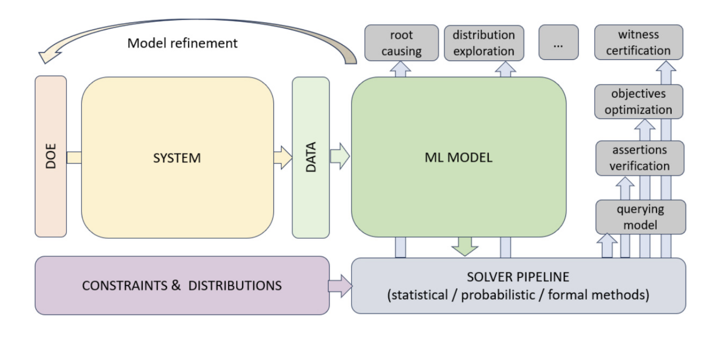

# SMLP -- Symbolic Machine Learning Prover

SMLP is a tool for verification and optimisation of systems modelled using machine learning.
SMLP uses symbolic reasoning for ML model exploration and optimisation under verification and stability constraints.

SMLP modes:

- optmization 
- verification
- synthesis
- exploration 
- root cause analysis

Sytems can be seen as black-box functions that can be sampled.
