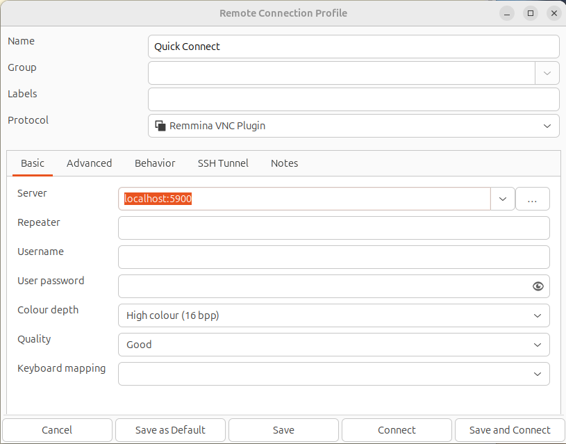

# GUI support and data sharing for Docker containers 

## Overview

### Validated Ubuntu environments

- `Ubuntu 24.04` 
- `Windows 11/WSL2` with `Ubuntu 24.04` installed and [wslg](https://learn.microsoft.com/en-us/windows/wsl/tutorials/gui-apps) enabled

**Data sharing**

All `enter*` commands mentioned below create `$HOME/shared` directory and mount it to container `/shared` directory

**Docker Hub Images Details:**

| Repository | Tag | Image ID | Image size |
|--------------------------------------------------|-------|-------------|-----------|
| mdmitry1/smlp-test-build-opensuse\_15.5-python311 | latest | 8bd8f5a0a6f1 | 7.72GB
| mdmitry1/smlp-test-build-almalinux\_9-python311   | latest | db28f324b82e | 7.53GB
| mdmitry1/smlp-test-build-ubuntu\_22.04-python311  | latest | aaeae9e7b068 | 7.44GB
| mdmitry1/python311-dev                            | latest | a28747d7ec0e | 6.76GB

## Quick Start

### Run Container with VNC

- Recommended VNC servers:
  - Windows: VNC
  - Ubuntu 24.04: remmina

[VNC installation instructions](./VNC.md)

- Remmina installation command

```bash
sudo apt install remmina
```

Configure `remmina` as shown below:

<br><br>


Run container:

```bash
enter_container [<image_name>[:<tag>]]
```

Default container for all enter commands: `mdmitry1/python311-dev:latest`

## Setting Up GUI Support for Ubuntu 24.04 using X11 forwarding

1. Install `socat`

```bash
sudo apt install socat
```

2. Run command

```bash
enter_container_x11_forwarding [<image_name>[:<tag>]]
```

## GUI Support for WSL2 with wslg installed

Run command

```
enter_container_wslg [<image_name>[:<tag>]]
```

