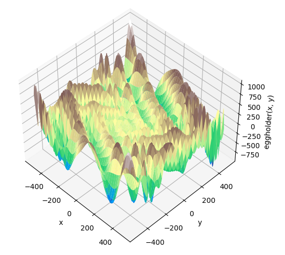
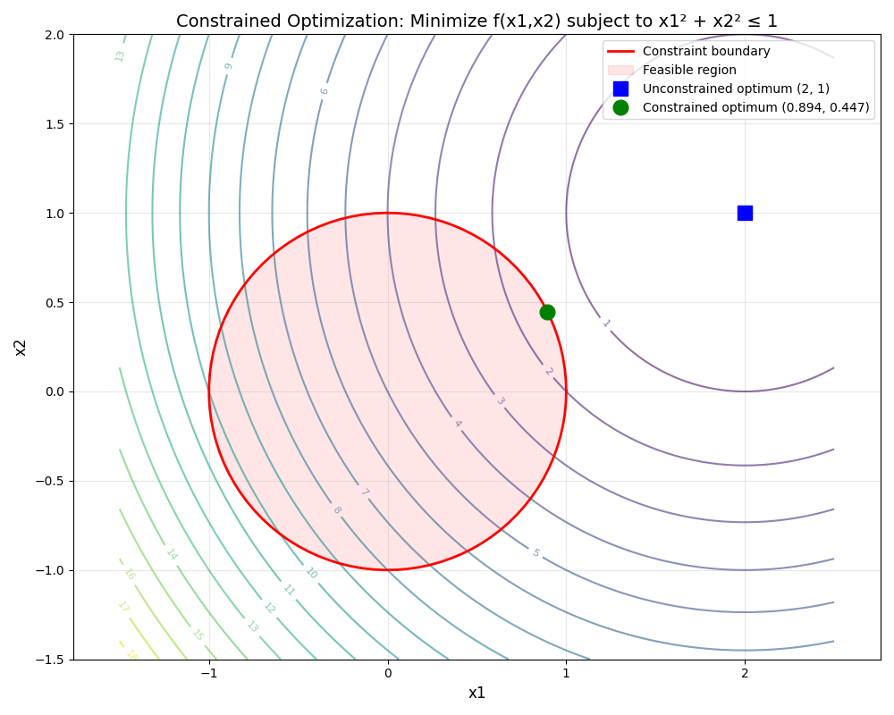
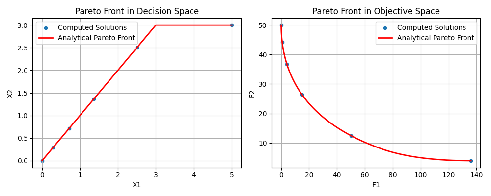
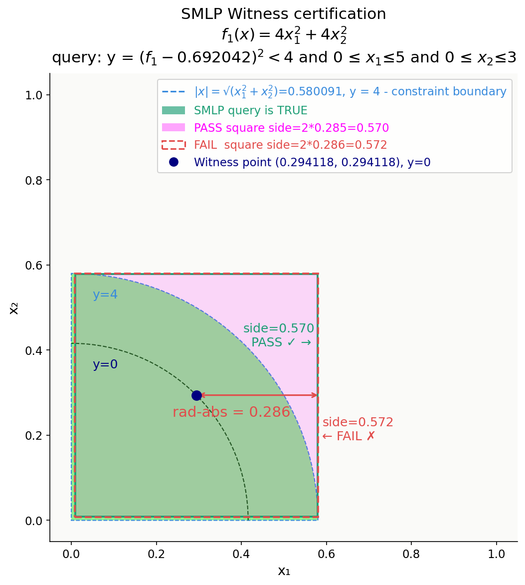
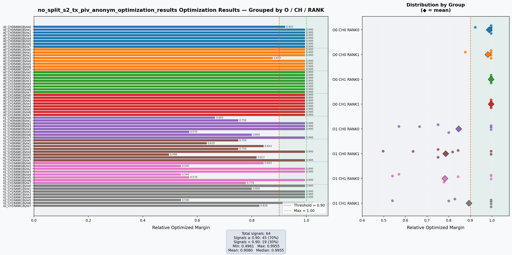
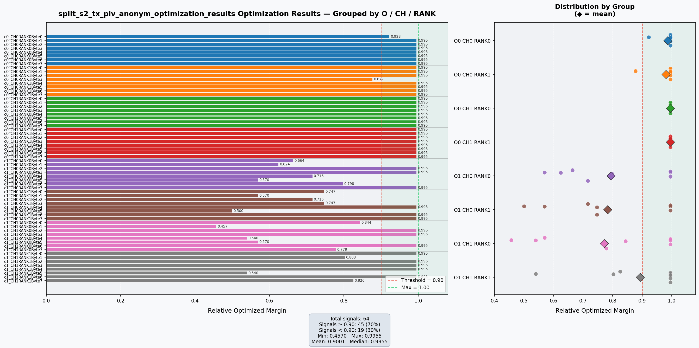

# SMLP Optimization Examples

This tutorial contains three benchmark optimization problems and one industrial example demonstrating the capabilities of SMLP (Symbolic Machine Learning Prover) for solving constrained and multi-objective optimization tasks for **black-box functions**.<br>
For one of the optimization examples tutorial demonstrates SMLP **result certification** - unique SMLP feature, which allows to validate solution robustness.SMLP addresses this through its notion of stability, ensuring that selected optima remain within stability region [3].  

Black-box function optimization definition used in this document [2]:
#### *Blackbox optimization (BBO) is the study of design and analysis of algorithms for optimization problems in which the structure of the objective function f and/or the constraints defining the set Ω is unknown, unexploitable or non-existant*<br>
*In above definiton Ω is the feasible region : Ω → R* 

SMLP has been applied in industrial setting at Intel for analyzing and optimizing hardware designs at the analog level [1].<br>
This tutorial contains one of Intel examples in Signal Integrity domain (with mangled numerical values and objective function names).

### In [SMLP](https://github.com/SMLP-Systems/smlp/blob/master/README.md)
- Structure of the objective function *f* is unknown
- Constraint defining set is comprised of known functions, which are defined by Python expressions

**SMLP** supports multiple modes: optimization, synthesis, verification and more.<br>
This tutorial focuses on optimization mode.<br>
In future it may be extended to other modes.

### SMLP optimization flow is comprised of two stages:
<details>
<summary>Model build</summary>
Input data is converted into one of supported model types<br>
1. Polynomial model<br>
2. Decision Trees<br>
3. Random Forest<br>
4. Extremely Randomized Trees<br>
5. Neural network model<br>
</details>
<details>
<summary>Optimization</summary> Model and constraints are used to find objective function(s) maximum considering input constraints
</details>

## Overview

Examples in this tutorial showcase SMLP's ability to:
- Handle single and multi-objective optimization
- Manage complex constraints
- Find global optima in challenging landscapes
- Generate Pareto fronts for multi-objective problems

[1] [Franz Brauße, Zurab Khasidashvili, Konstantin Korovin. SMLP: Symbolic Machine Learning Prover](https://arxiv.org/pdf/2402.01415v1)<br>
[2] [Stéphane Alarie et al. Two decades of blackbox optimization applications](https://optimization-online.org/wp-content/uploads/2020/10/8082.pdf)<br>
[3] [Yonina C. Eldar and Amir Beck. A Minimax Chebyshev Estimator for Bounded Error Estimation](https://ece.technion.ac.il/wp-content/uploads/2021/01/publication_617-1.pdf)

### Examples

### 1. Eggholder Function

**Location:** `examples/eggholder/smlp/`

A challenging global optimization problem commonly used for benchmarking optimization algorithms.

#### Problem Definition

The [Eggholder function](https://www.sfu.ca/~ssurjano/egg.html) is defined as:

```
f(x, y) = -(y + 47) * sin(√|x/2 + (y + 47)|) - x * sin(√|x - (y + 47)|)
```

<br>

**Domain:** -512 ≤ x₁, x₂ ≤ 512

**Expected Global Minimum:** f(x*) = -959.6407 at x* = (512, 404.2319)<br>
**SMLP Results:**            f(x*) = -955.6113 at x* = (511.9, 405.3)<br>
SMLP options used in this example can be found in: `examples/eggholder/smlp/run_eggholder`

#### Characteristics
- Highly multi-modal with many local minima
- Complex, irregular landscape
- Excellent test for global optimization algorithms
- Single objective (minimization)

#### Files
- `eggholder.json` - SMLP configuration file
- `eggholder_dataset.py` - Dataset generator and visualization
- `eggholder_optimization_results_expected.json` - Expected optimization results
- `eggholder_benchmark_expected.txt` - Benchmark data

#### Usage

```bash
# Generate dataset and vizualize
./examples/eggholder/smlp/eggholder_dataset.py
```

```bash
# Run optimization with SMLP
./examples/eggholder/smlp/run_eggholder
```

---

### 2. Constrained DORA (Distance to Optimal with Radial Adjustment)

**Location:** `examples/constraint_dora/smlp/`

A classic textbook example of constrained optimization using Lagrange multipliers.

#### Problem Definition

**Minimize:** f(x₁, x₂) = (x₁ - 2)² + (x₂ - 1)²

**Subject to:** x₁² + x₂² ≤ 1 (inside unit circle)

**Geometric Interpretation:** Find the point on the unit circle closest to (2, 1)

<br>

#### Analytical Solution

Using Lagrange multipliers (∇f = λ∇g):
- x₁ = 2/(1+λ)
- x₂ = 1/(1+λ)
- From constraint: 5 = (1+λ)²
- λ = √5 - 1

**Expected Results:** x₁ ≈ 0.894427, x₂ ≈ 0.447214, f ≈ 1.527864<br>
**SMLP Results:**     x₁ = 0.894531, x₂ = 0.447004, f = 1.527865

[Reference: Wolfram Alpha](https://www.wolframalpha.com/input?i=Minimize%3A+f%28x1%2C+x2%29+%3D+%28x1+-+2%29%5E2+%2B+%28x2+-+1%29%5E2+subject+to+x1%5E2+%2B+x2%5E2+-+1+%3C%3D+0)

#### Characteristics
- Single objective with constraint
- Demonstrates constrained optimization
- Known analytical solution for verification
- Geometric intuition (distance from point to circle)

#### Files
- `constraint_dora.json` - SMLP configuration file
- `constraint_dora_dataset.py` - Dataset generator with visualization
- `constraint_dora_poly_optimization_results_expected.json` - Expected results
- `constraint_dora_poly_benchmark_expected.txt` - Benchmark data

#### Usage
```bash
# Generate dataset and visualize
./examples/constraint_dora/smlp/constraint_dora_dataset.py

# Run optimization with SMLP
./examples/constraint_dora/smlp/run_constraint_dora_poly
```

---

### 3. Binh and Korn (BNH) Multi-Objective Problem

**Location:** `examples/bnh/smlp/`

A classic multi-objective optimization problem with two objectives and two constraints.

#### Problem Definition

**Minimize:**
```
f₁(x) = 4x₁² + 4x₂²
f₂(x) = (x₁ - 5)² + (x₂ - 5)²
```

**Subject to:**
```
C₁(x) = (x₁ - 5)² + x₂² ≤ 25
C₂(x) = (x₁ - 8)² + (x₂ + 3)² ≥ 7.7
0 ≤ x₁ ≤ 5
0 ≤ x₂ ≤ 3
```

**Expected Results:** 

|  x₁  | x₂ | f₁ | f₂ |
|---------|-----------|------------|-------------|
| 0  | 0 | 0 | 50 | 
| 0.294118 | 0.294118 | 0.692042 | 44.290657  |
| 0.714286 | 0.714286 | 4.081633 | 36.734694 |
| 1.363636 | 1.363636 | 14.876033 | 26.446281 |
| 2.5 | 2.5 | 50 | 12.5 |
| 5 | 3 | 136 | 4 |

Expected results reproduction:
```bash
./examples/bnh/smlp/pareto_analytical.py
```

**SMLP Results:** 

|  x₁  | x₂ | f₁ | f₂ |
|---------|-----------|------------|-------------|
| 0  | 0 | 0 | 50 | 
| 0.294118 | 0.296875 | 0.698560 | 44.264713  |
| 0.714286 | 0.718750 | 4.107223 | 36.696449 |
| 1.363636 | 1.363281 | 14.872160 | 26.448864 |
| 2.5 | 2.5 | 50 | 12.5 |
| 5 | 3 | 136 | 4 |

<br>

[Reference: Test Case 2, Binh and Korn (1997)](https://web.archive.org/web/20190801183649/https://pdfs.semanticscholar.org/cf68/41a6848ca2023342519b0e0e536b88bdea1d.pdf)

#### Characteristics
- Two competing objectives (minimize both)
- Two non-linear constraints
- Well-defined Pareto front
- Constraints add difficulty without eliminating feasibility

#### Pareto Front Structure

In decision space:
- Segment 1: x₁ = x₂ for x ∈ [0, 3]
- Segment 2: x₁ ∈ [3, 5], x₂ = 3

#### Files
- `bnh.json` - SMLP configuration file
- `bnh_dataset.py` - Dataset generator
- `bnh_pareto_X1_expected.txt` - Expected Pareto X₁ values
- `bnh_pareto_X2_expected.txt` - Expected Pareto X₂ values
- `bnh_pareto_F1_expected.txt` - Expected Pareto F₁ values
- `bnh_pareto_F2_expected.txt` - Expected Pareto F₂ values
- `plot_results.py` - Visualization script for Pareto fronts
- `run_optimize.sh` - SMLP driver: Approximates Pareto front using the [weighted sum method](https://www.sciencedirect.com/topics/computer-science/weighted-sum-method) 

#### Usage
```bash
# Generate dataset
./examples/bnh/smlp/run_poly_pareto/bnh_dataset.py

# Run optimization for each weighting and plot Pareto front
./examples/bnh/smlp/run_poly_pareto

# Visualize Pareto front and compare simulation Pareto front to analytical
./examples/bnh/smlp/plot_results.py

# Create analytical Pareto front
./examples/bnh/smlp/pareto_analytical.py
```

#### Pareto point robustness ceritification example

Below we demonstrate SMLP robustness certification accuracy for the second Pareto front point of the function `f₁`.<br>
We check (*certify*) stability of analytical Pareto solution (*witness*) `f₁(x₁,x₂) = 0.692042`<br>
where  `x₁' = x₂' = 0.294118` within stability region.<br>
Stability region is defined as a square with apothem `rad-abs`.<br>
Assertion, chosen for this example:

```
y = (f₁(x₁,x₂) - 0.692042)² < 4
```
Analytical solution for this problem:<br>
- assertion should pass for: `rad-abs < 0.285973`
- assertion should fail for: `rad-abs ≥ 0.285973`

**SMLP results:**

<br>

From this plot one can see that as expected:
- <p style="color: green;">assertion passes for rad-abs=0.285</p>
- <p style="color: red;">assertion fails for rad-abs=0.286</p>

Above result clearly demonstrates high SMLP accuracy.

#### Certification demo script usage - run SMLP and display results:

```bash
examples/bnh/smlp/run_certify.sh
```

#### Plot certification results:

```bash
examples/bnh/smlp/witness_certify_plot.py
```


### 4. Intel Signal Integrity domain example

**Location:** `examples/si/smlp`

#### Problem Definition

Multi-Objective optimization problem with 64 objectives and 4 categorical parameters.
This is Intel I/0 test with lab data collected at Intel, the feature names and values are mangled. 
The I/O system has two channels, two ranks, and 8 bytes. 
Optimization objectives o1 and o2 stand for eye height and eye width.
Total number of optimization objectives is `2*2*8*2=64`.
The I/O system has four knobs of numeric type, for each a range of values (an interval) and grid of possible values within the interval is specified in the spec file. 

#### Configuration File

../tests/bench/intel/specs/s2\_tx\_piv\_anonym.spec

#### Input Dataset

../tests/bench/intel/data/s2\_tx\_piv\_anonym.csv.bz2

#### Usage

```bash
#Regular run

examples/si/smlp/run_si_test_nosplit
```

```bash
#Run, in which all input data is used for training

examples/si/smlp/run_si_test_split
```

#### Visualize results

```bash
#Regular run

examples/si/smlp/extract_results no_split_s2_tx_piv_anonym_optimization_results.json

#Run, in which all input data is used for training

examples/si/smlp/extract_results split_s2_tx_piv_anonym_optimization_results.json
```

Results will be shown on the screen and then saved to the png files:

```bash
no_split_s2_tx_piv_anonym_optimization_results.png
split_s2_tx_piv_anonym_optimization_results.png
```

<br>
<br>

### 5. Running all examples

```bash
./run_all
```

## SMLP Configuration Structure

All examples use JSON configuration files with the following structure:

```json
{
  "version": "1.2",
  "variables": [
    {"label": "X1", "interface": "knob", "type": "real", "range": [min, max], "rad-abs": 0.0},
    {"label": "Y1", "interface": "output", "type": "real"}
  ],
  "alpha": "constraint_expression",
  "objectives": {
    "objective1": "expression_to_minimize"
  }
}
```

### Key Fields

- **variables**: Define input variables (knobs) and output variables
  - `interface`: "knob" for controllable variables, "input" for inputs, "output" for outputs
  - `range`: Valid range for input variables
  - `rad-abs`: Radius for absolute perturbation (0.0 = exact values)

    SMLP finds optimal values for knobs<br>
    Inputs are "free" - they are not altered during optimization

- **alpha**: Constraint expression using variable labels
  - Supports arithmetic operations: `+`, `-`, `*`, `/`
  - Supports logical operations: `and`, `or`
  - Supports comparisons: `<=`, `>=`, `<`, `>`, `==`

- **objectives**: One or more objectives to optimize
  - For minimization, negate the objectives as SMLP searches for a maximum
  - Can combine multiple outputs with weights

---

## Dataset Generation

Each example includes a Python script to generate training data:

### Common Pattern
```python
from numpy import linspace, meshgrid
from gzip import open as gzopen

# Define grid
x1 = linspace(x1_min, x1_max, n_points)
x2 = linspace(x2_min, x2_max, n_points)
X1, X2 = meshgrid(x1, x2)

# Compute outputs
Y = objective_function(X1, X2)

# Write compressed dataset
with gzopen("dataset.txt.gz", "wt") as ds:
    ds.write("X1 X2 Y1\n")
    for i in range(n_points):
        for j in range(n_points):
            ds.write(f"{X1[i][j]} {X2[i][j]} {Y[i][j]}\n")
```

### Visualization Support

Dataset generators include optional visualization:
- Matplotlib 3D surface plots (Eggholder)
- Contour plots with constraint boundaries (DORA)
- Command-line timeout option for automation

---

## Expected Results

Each example includes expected results for verification:

### JSON Result Format
```json
{
  "objective1": {
    "X1": optimal_x1,
    "X2": optimal_x2,
    "Y1": optimal_output,
    "objective1": objective_value,
    "threshold_lo": lower_bound,
    "threshold_up": upper_bound
  },
  "smlp_execution": "completed",
  "synthesis_feasible": "true"
}
```

### Verification
Compare your optimization results against the `*_expected.json` files to validate SMLP performance.

---

## Dependencies

### Python Requirements
```
numpy
matplotlib
pandas
seaborn
```

### Installation
```bash
pip install numpy matplotlib pandas seaborn
```

### SMLP Installation

See [README.md](https://github.com/SMLP-Systems/smlp/blob/master/README.md)

### SMLP Options
```bash
python3.11 $(git rev-parse --show-toplevel)/src/run_smlp.py -h 
```
---

## Running the Examples

### Basic Workflow

1. **Generate Dataset**
   ```bash
   ./examples/<example_name>/smlp/<example_name>_dataset.py
   ```

2. **Run Optimization**
   ```bash
   python3.11 $(git rev-parse --show-toplevel)/src/run_smlp.py -data <csv_file>  --spec <json_file> <smlp_parameters>
   ```

3. **Visualize Results** (BNH only)
   ```bash
   ./examples/bnh/smlp/plot_results.py
   ```

### Datasets visualization Options

Eggholder and Constraint DORA dataset generators support timeout (specified in seconds) for automated testing:

```bash
./examples/eggholder/smlp/eggholder_dataset.py -timeout 5
./examples/constraint_dora/smlp/constraint_dora_dataset.py  -timeout 5 
```

---

## Problem Characteristics Summary

| Example | Variables | Objectives | Constraints | Difficulty |
|---------|-----------|------------|-------------|------------|
| Eggholder | 2 | 1 | None | High (multi-modal) |
| DORA | 2 | 1 | 1 (circular) | Low (convex) |
| BNH | 2 | 2 | 2 (non-linear) | Medium |

---

## References

### Eggholder
- [Virtual Library of Simulation Experiments](https://www.sfu.ca/~ssurjano/egg.html)

### Constrained DORA
- [Wolfram Alpha Solution](https://www.wolframalpha.com/input?i=Minimize%3A+f%28x1%2C+x2%29+%3D+%28x1+-+2%29%5E2+%2B+%28x2+-+1%29%5E2+subject+to+x1%5E2+%2B+x2%5E2+-+1+%3C%3D+0)

### BNH
- Binh, T. and Korn, U. (1997). [MOBES: A multiobjective evolution strategy for constrained optimization problems](https://web.archive.org/web/20190801183649/https://pdfs.semanticscholar.org/cf68/41a6848ca2023342519b0e0e536b88bdea1d.pdf)
  Test Case 2 on Page 6
---

## Contributing

When adding new examples, please include:
1. Problem definition and mathematical formulation
2. Dataset generation script with visualization
3. SMLP configuration file(s)
4. Expected results for verification
5. README documentation following this template

---

## License

Please refer to the main repository license for usage terms.

---

## Support

For issues or questions:
- [SMLP User Manual](https://arxiv.org/pdf/2405.10215v1)
- Example-specific issues: See individual example READMEs
- General optimization questions: Consult the references provided

---

*Last updated: February 2026*
