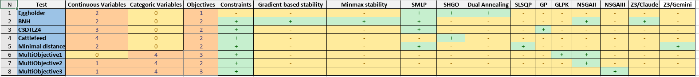
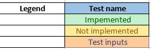
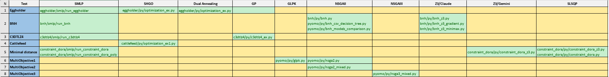
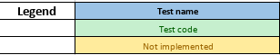
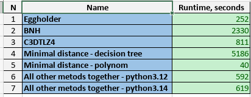

## Test Cases: number of variables, number of objectives, number of and type of constraints
1. **Eggholder**: two continuos variables, one objective, no constraints: `SMLP`, `SHGO, Dual Annealin`g
2. **BNH**: two continuos variables, two objectives, non linear constraints: `SMLP`, `NSGAII`, `Z3/Claude`
3. **c3dtlz4**: three continuos variables, two objectives, non linear constraints: `SMLP`, `GP`
4. **cattlefeed**: four continuos variables, one objective, non linear constraints: `SHGO`
5. **Syntetic tests**, generated by `Claude Sonnet 4.5 free version` 
5.1 Minimal distance between point and circle: two continuos variables, two objectives, non linear constraints: `SMLP`, `SLSQP`, `Z3/Gemini` 
5.2 Multiobjective optimization with continuos and categorical variables 
5.2.1 `GLPK`: four categorical variables, three objectives, non-linear constraints 
5.2.1 `NSGA-II`: four categorical variables, three objectives, non-linear constraints 
5.2.2 `NSGA-II`: one continuos and four categorical variables, two objectives, no constraints 
5.2.3 `NSGA-III`: one continuos and four categorical variables, three objectives, no constraints  
**Study coverage** 

  
**Study code** 

  
**Study SMLP benchmarks** 
 
- [Study - details ](media/study.xlsx)
## Regression
- python3.12: `run_smlp_tutorial_clone_and_examples`
- python3.14: `run_smlp_tutorial_clone_and_examples_314`
## Priorities
1. **Move to** `python3.12`
- Justification: `python3.12` is the default version for **Ubuntu 24.04** (current release)
- **Ubuntu 26.04** (next release) will have `python3.14` as a default
2. **Enhance Pareto** to provide more than one point in one run
- Justification: this is common practice in alternative tools
3. **Performance improvement**
- Justification: all other methods are much faster
