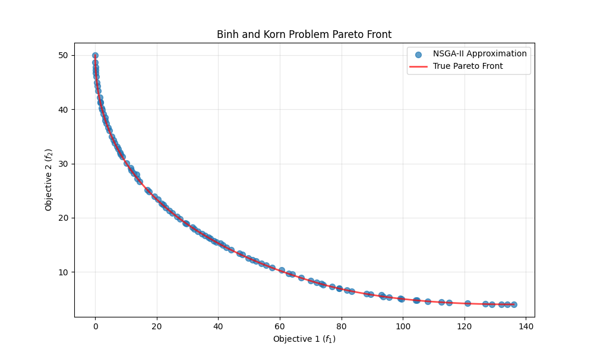
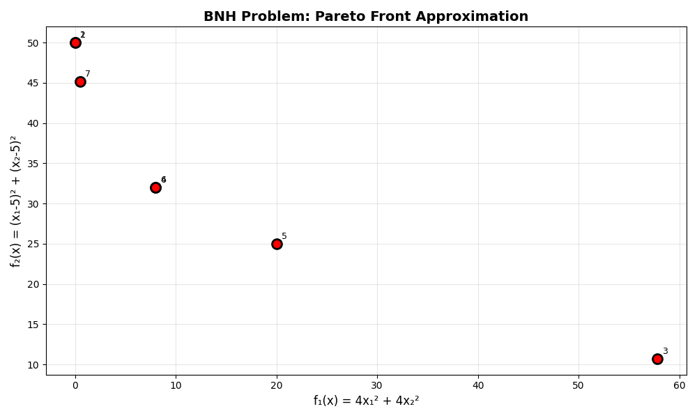

# Binh and Korn (BNH) Multi-Objective Optimization Problem

[Binh and Korn (BNH) Multi-Objective Optimization Problem](https://pymoo.org/problems/multi/bnh.html)

## Multivariate Constrained Problem

### Problem Definition

**Minimize:**

```math
    f₁(x) = 4x₁² + 4x₂² 
    f₂(x) = (x₁ - 5)² + (x₂ - 5)²
```

**Subject to:**

```math
    C₁(x) = (x₁ - 5)² + x₂² ≤ 25 
    C₂(x) = (x₁ - 8)² + (x₂ + 3)² ≥ 7.7
    0 ≤ x₁ ≤ 5 
    0 ≤ x₂ ≤ 3
```

Expected and NSGA-II approximation results:

Expected Z3 results:

Expected Z3 stable results (3 flavors):


