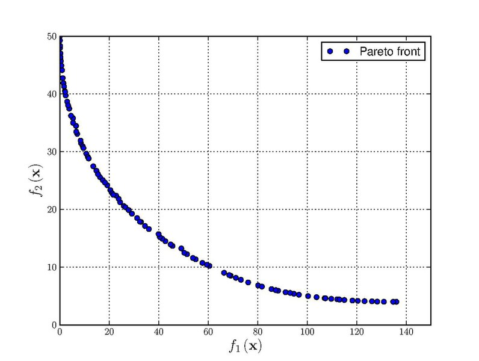

# Binh and Korn (BNH) Multi-Objective Optimization Problem

### Problem Definition

**Minimize:**

```math
    f₁(x) = 4x₁² + 4x₂² 
    f₂(x) = (x₁ - 5)² + (x₂ - 5)²
```

**Subject to:**

```math
    C₁(x) = (x₁ - 5)² + x₂² ≤ 25 
    C₂(x) = (x₁ - 8)² + (x₂ + 3)² ≥ 7.7
    0 ≤ x₁ ≤ 5 
    0 ≤ x₂ ≤ 3
```

[Reference: Test Case 2 on page 6](https://web.archive.org/web/20190801183649/https://pdfs.semanticscholar.org/cf68/41a6848ca2023342519b0e0e536b88bdea1d.pdf)

### [Expected result:](https://en.wikipedia.org/wiki/File:Binh_and_Korn_function.pdf)

