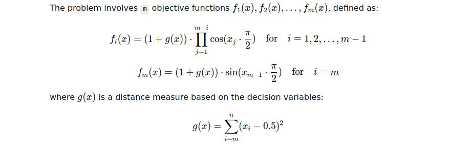

# C3-DTLZ4 Problem

**C3-DTLZ4** is a test problem used for evaluating multi-objective optimization algorithms. 
It is a variant of the DTLZ4 problem that is modified to have a continuous and constrained objective space.  
The problem is commonly used in evolutionary multi-objective optimization tasks.

## Problem Definition

The **C3-DTLZ4** problem is defined by the following characteristics:

- **Decision Variables**: The problem involves n decision variables, where n is the number of variables in the optimization problem.
- **Objectives**: The problem aims to optimize m objective functions, where m is the number of objectives.
- **Constraints**: The problem is constrained, making it more challenging for multi-objective optimization algorithms.

### Mathematical Formulation

Let’s define the problem mathematically:

1. **Decision Variables**:  
   The decision variables x = (x1, x2, ..., xn), where:
   xᵢ ∈ [0, 1] for i = 1, 2, ..., n

2. **Objectives**:  

[The problem involves m objective functions f₁(x), f₂(x), ..., fm(x), defined as: ]: #

[fᵢ(x) = (1 + g(x)) * ∏(cos(xⱼ * π / 2)) for i = 1, 2, ..., m-1 ]: #

[fₘ(x) = (1 + g(x)) * sin(xₘ₋₁ * π / 2) for i = m ]: #

3. **Objective Function Evaluation**:  
   The multi-objective functions are evaluated based on the decision variables, taking into account both the objective contributions and the constraints.  
The problem involves evaluating the contributions of each objective with respect to the cosine and sine transformations.

4. **Constraints**:  
   The C3-DTLZ4 problem involves constraints on the decision variables, which must be satisfied for a solution to be considered feasible. 
   These constraints can be customized but are generally designed to limit the feasible region of the problem and increase the difficulty of the optimization task.

---

## Key Features

- **Multi-objective**: The C3-DTLZ4 problem involves multiple objectives that are often conflicting, making it suitable for testing algorithms that aim to find a diverse set of solutions.
- **Continuous Variables**: The decision variables are continuous, which adds complexity to the problem as it requires precise optimization across a continuous decision space.
- **Constrained Optimization**: The problem includes constraints that restrict the possible solutions, simulating more realistic optimization tasks where not all candidate solutions are valid.

---

## Applications

The C3-DTLZ4 problem is particularly useful for:

- **Benchmarking Multi-Objective Optimization Algorithms**: Its complexity makes it a good test problem for new algorithms in evolutionary optimization.
- **Evaluating Pareto Front Approximations**: The problem has an exact Pareto front, which can be used to evaluate how well optimization algorithms approximate the Pareto-optimal solutions.

---

## References

- Deb, K., & Jain, H. (2014). An Evolutionary Multi-Objective Optimization Algorithm Based on Dominated Sorting. **IEEE Transactions on Evolutionary Computation**, 18(1), 72–96.
- Deb, K., Pratap, A., Agarwal, S., & Meyarivan, T. (2002). A Fast and Elitist Multiobjective Genetic Algorithm: NSGA-II. **IEEE Transactions on Evolutionary Computation**, 6(2), 182–197.
