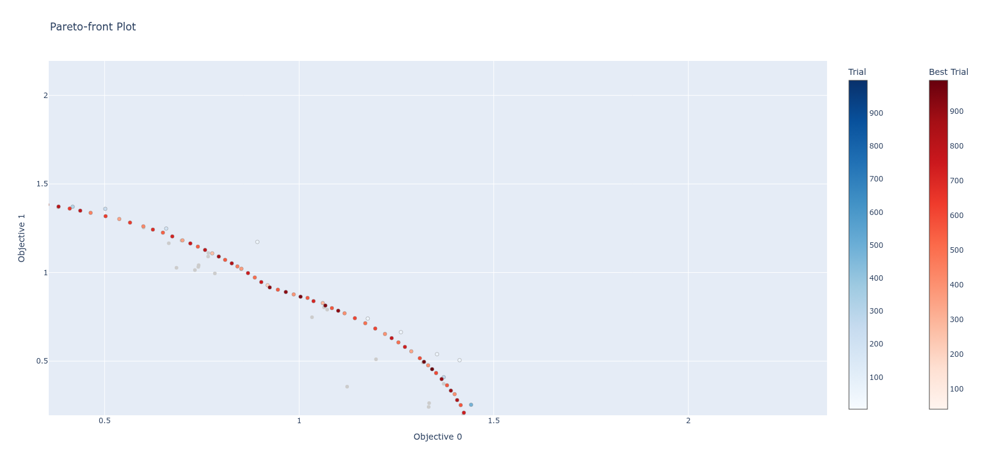
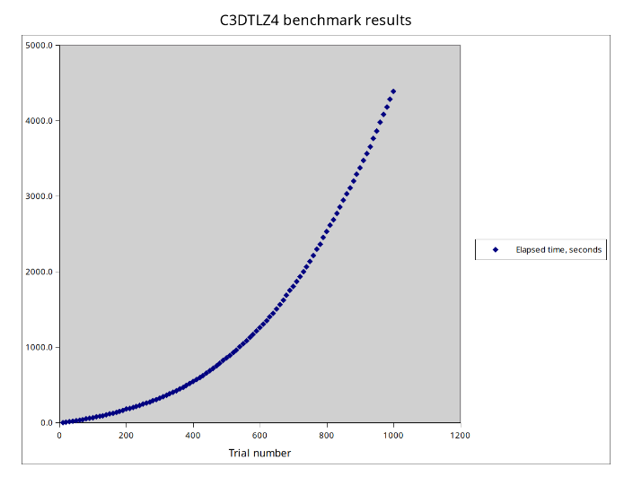

# C3-DTLZ4 Problem Description

## Overview

C3-DTLZ4 is a constrained multi-objective optimization benchmark problem that combines the DTLZ4 objective functions with C3-type constraints. It is part of the constrained DTLZ test suite.

**References:**
- [Scalable test problems for evolutionary multi-objective optimization](https://www.research-collection.ethz.ch/bitstream/handle/20.500.11850/145762/eth-24696-01.pdf), _8.4 Test Problem DTLZ4_
- [Multi-point acquisition function for constraint parallel efficient multiobjective optimization](https://dl.acm.org/doi/pdf/10.1145/3512290.3528696), p. 517 
- [Constrained Bi-objective Surrogate-Assisted Optimization of Problems with Heterogeneous Evaluation Times: Expensive Objectives and Inexpensive Constraints](https://www.egr.msu.edu/~kdeb/papers/c2020019.pdf), fig. 4
- [C3-DTLZ4 objective functions and constraints source code](https://github.com/optuna/optunahub-registry/blob/main/package/benchmarks/dtlz_constrained/_dtlz_constrained.py)

## Problem Formulation

### Decision Variables

- **Number of variables**: n (typically n = m + 4 where m is the number of objectives)
- **Variable bounds**: xᵢ ∈ [0, 1] for all i = 0, 1, ..., n-1
- **Variable types**:
  - First m-1 variables (x₀, x₁, ..., xₘ₋₂): **Position variables** (control location on Pareto front)
  - Last k = n - m + 1 variables: **Distance variables** (affect convergence)

### Objective Functions (DTLZ4)

The **g-function** uses the last k distance variables:

```
g(xₘ) = Σ(xᵢ - 0.5)² for i = m-1 to n-1
```

where xₘ = {xₘ₋₁, xₘ, ..., xₙ₋₁} are the distance variables.

The **objective functions** are defined as:

```
f₁(x) = (1 + g) × cos(x₀^α × π/2) × cos(x₁^α × π/2) × ... × cos(xₘ₋₂^α × π/2)

f₂(x) = (1 + g) × cos(x₀^α × π/2) × cos(x₁^α × π/2) × ... × sin(xₘ₋₂^α × π/2)

...

fₘ₋₁(x) = (1 + g) × cos(x₀^α × π/2) × sin(x₁^α × π/2)

fₘ(x) = (1 + g) × sin(x₀^α × π/2)
```

where α = 100 is the density parameter.

**Optimization goal**: Minimize all objectives.

### Constraint Functions (C3-Type)

For each objective fᵢ, there is a constraint:

```
cᵢ = -(f₁² + f₂² + ... + fₘ²) + 0.75 × fᵢ + 1.0 ≤ 0
```

**Feasibility condition**: A solution is feasible if **ALL** constraints are satisfied (i.e., cᵢ ≤ 0 for all i).

---

## Example: Two Objectives with and three Variables

This is a minimal configuration for understanding the problem.

### Problem Setup

- **Decision variables**: x = [x₀, x₁, x₂] where xᵢ ∈ [0, 1]
  - x₀: Position variable (controls location on Pareto front)
  - x₁, x₂: Distance variables (affect convergence)

### Calculations

1. **g-function**:
   ```
   g = (x₁ - 0.5)² + (x₂ - 0.5)²
   ```

2. **Objectives**:
   ```
   f₁ = (1 + g) × cos(x₀^100 × π/2)
   f₂ = (1 + g) × sin(x₀^100 × π/2)
   ```

3. **Constraints**:
   ```
   c₁ = -(f₁² + f₂²) + 0.75 × f₁ + 1.0
   c₂ = -(f₁² + f₂²) + 0.75 × f₂ + 1.0
   ```

## Calculated Pareto front for 1000 trials

<br>

- Benchmark results for: LENOVO_MT_80X2_BU_idea_FM_ideapad 520S-14IKB<br> 
  CPU: Intel(R) Core(TM) i5-7200U CPU @ 2.50GHz dual core with hyperthreading<br>
  GPU: GeForce 940MX<br>
  User time: _12981.400u_ System time: _783.892s_ Elapsed time: _1:16:27.20_ Average CPU load: _300.0%_




## Key Characteristics

### Difficulty Features

1. **Biased density**: _The alpha = 100 parameter creates a non-uniform distribution of solutions on the Pareto front_
2. **Convergence challenge**: _The g-function requires distance variables to be exactly 0.5 for optimality_
3. **Constrained feasible region**: _C3 constraints restrict portions of the objective space_

### Properties

- **Type**: Multi-modal, scalable
- **Pareto front shape**: Spherical segment
- **Constraint complexity**: Multiple constraints that depend on objective values
- **Feasible region**: The constraints create a feasible region that excludes solutions near the coordinate axes

---

## Summary

C3-DTLZ4 is a constrained multi-objective benchmark problem that:
- Uses DTLZ4 objectives with biased density (α=100)
- Applies C3-type constraints based on objective values
- Tests optimization algorithms' ability to handle both convergence and constraint satisfaction
- Is scalable to any number of objectives and variables

## Validation: optimization using [Gaussian Process Sampler](https://medium.com/optuna/introducing-optunas-native-gpsampler-0aa9aa3b4840) 
```
pytest
```
