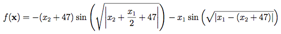

# Eggholder Function Optimization

This project demonstrates global optimization techniques using SMLP on the Eggholder function, a complex mathematical function commonly used for testing optimization algorithms.

## Overview

The [Eggholder function]( https://www.sfu.ca/~ssurjano/egg.html ) is a challenging optimization problem with many local minima, making it an excellent benchmark for testing global optimization algorithms. 
  
  
Global minimum: _f(x*) = -959.6407, at x* = (512, 404.2319)_
