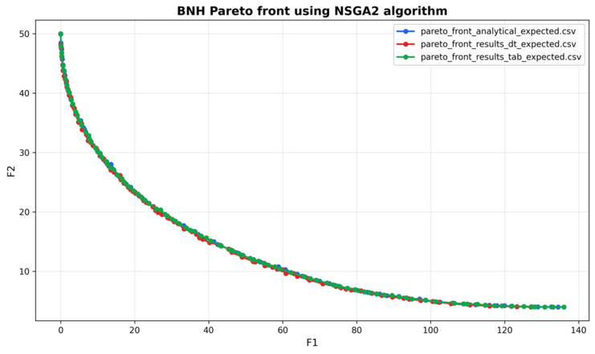

Pymoo and Pyomo MultiObjective optimization examples
====================================================

This directory contains<br>
- NSGA-II algorithm examples for BNH problem. In these examples Pareto front is created from dataset in csv format
- BNH pareto front comparison for 3 models: analytical, linear interpolation and decision tree
- NSGA-II algorithm example for multiobjective optimization  problem Pareto front approximation
- Linear programming example using GLPK

**Files**<br>
- **`bnh_csv.py`**: Uses a linear-interpolation-based  approach to approximate the Pareto front from CSV data 
- **`bnh_csv_decision_tree.py`**: Uses a decision-tree-based approach to approximate the Pareto front from CSV data 
- **`bnh_models_comparison.py`**: Comparison plots for NSGA2 algorithm with 3 models: analytical, linear interpolation and decision tree
- **`glpk.py`**: Script that formulates and solves the optimization problem using GLPK solver
- **`nsga2.py`**: Example of using NSGA2 solver for multiobjective optimization  problem Pareto front approximation  
- **`nsga2_mixed.py`**: Example of using NSGA2 solver with mixed variables. Pareto front approximation is created for each categorical variable
- **`objectives_data.csv`**: BNH input dataset
- **`pareto_front_analytical_expected.csv`**: Expected analytical Pareto front (reference) used in tests.
- **`pareto_front_results_dt_expected.csv`**: Expected results from the decision-tree approach (used by tests).
- **`pareto_front_results_tab_expected.csv`**: Expected tabular Pareto front results (used by tests).
- **test***.py files Run these with `pytest`.

```tcsh
    test_bnh_csv.py
    test_bnh_csv_decision_tree.py
    test_bnh_models_comparison.py
    test_glpk.py
    test_nsga2_df.py
    test_nsga2_mixed.py
```

**Requirements**
- Python 3.12+
- If you plan to run `glpk.py` via `pyomo` you will also need `pyomo` and GLPK installed on your system via system package `glpk`

Create a lightweight `requirements.txt`:<br>
- python3.14
```
glpk
numpy
pandas
scikit-learn
matplotlib
pytest
pymoo
pyomo
torch
```
- python3.12 **numpy should be installed by package manager in order to avoid possible version conflicts**

```
glpk
pandas
scikit-learn
matplotlib
pytest
pymoo
pyomo
torch
```

**Quickstart**

1. Install dependencies

```tcsh
pip install -r requirements.txt
```

2. Run example scripts:

```tcsh
python glpk.py
python nsga2.py
python bnh_csv.py
bnh_csv_decision_tree.py
bnh_models_comparison.py
```

3. Run the unit tests:

```tcsh
pytest -s
```

**Example - models comparison for BNH problem**<br><br>


**References**
- [Binh and Korn (BNH) Multi-Objective Optimization Problem](https://pymoo.org/problems/multi/bnh.html)
- [NSGA-II](https://sci2s.ugr.es/sites/default/files/files/Teaching/OtherPostGraduateCourses/Metaheuristicas/Deb_NSGAII.pdf)
- [GLPK](https://en.wikipedia.org/wiki/GNU_Linear_Programming_Kit)
- [Pymoo](https://pypi.org/project/pymoo)
- [GLPK Python wrapper](https://pypi.org/project/glpk)
- [Pyomo](https://pypi.org/project/pyomo)

**Notes & Troubleshooting**
- Below CSV files are used by pytest - don't change or remove them
```
objectives_data.csv
pareto_front_analytical_expected.csv
pareto_front_results_dt_expected.csv
pareto_front_results_tab_expected.csv
```
- If `glpk.py` fails due to solver issues, ensure GLPK (or another solver) is installed and accessible on `PATH`.
- If a script complains about missing Python packages, install them with `pip install <package>` or via the `requirements.txt` above.

